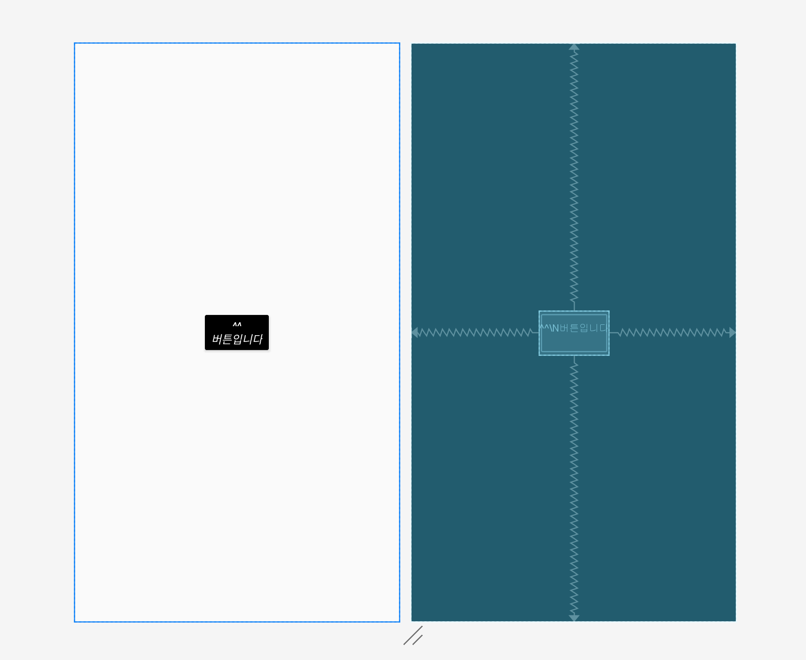
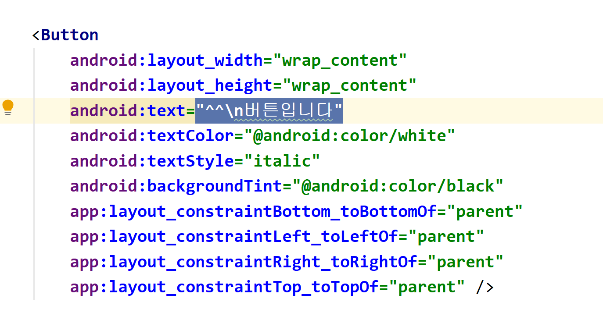
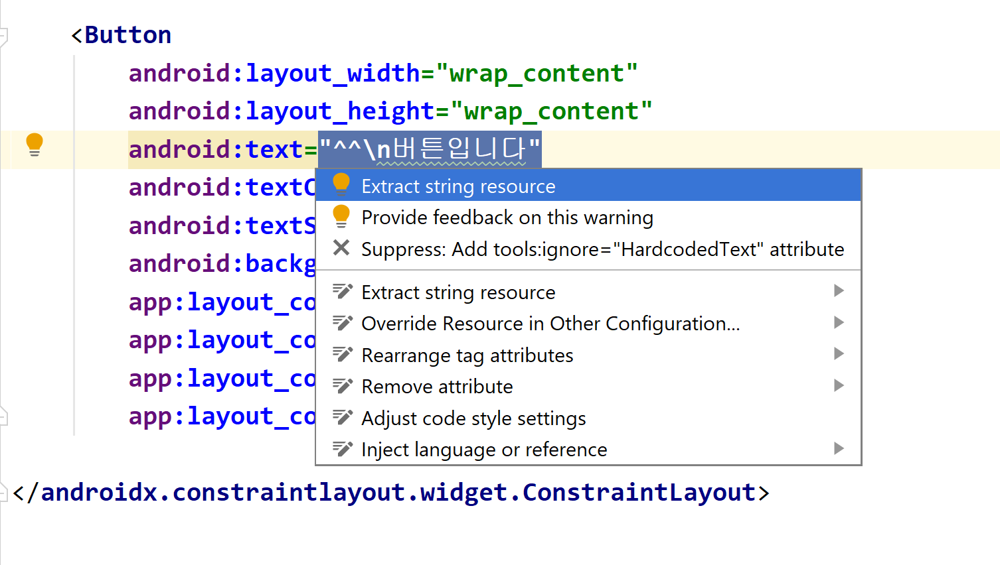
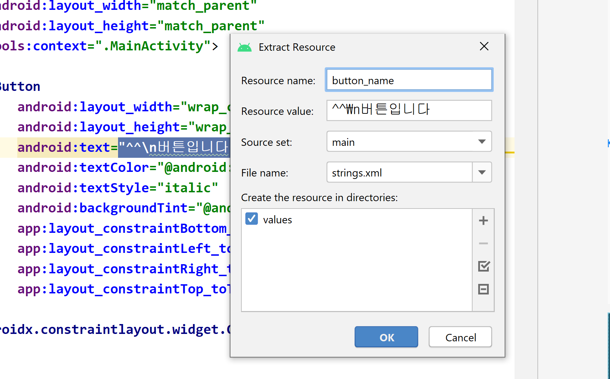
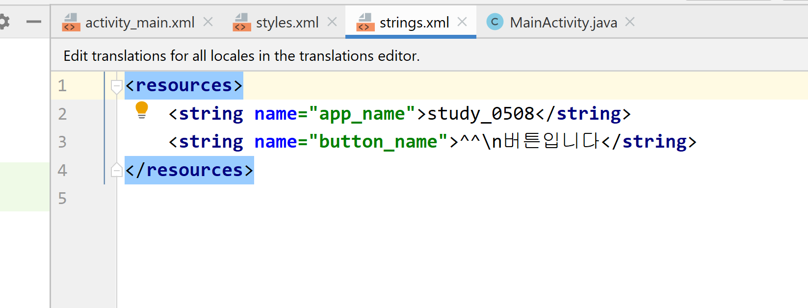
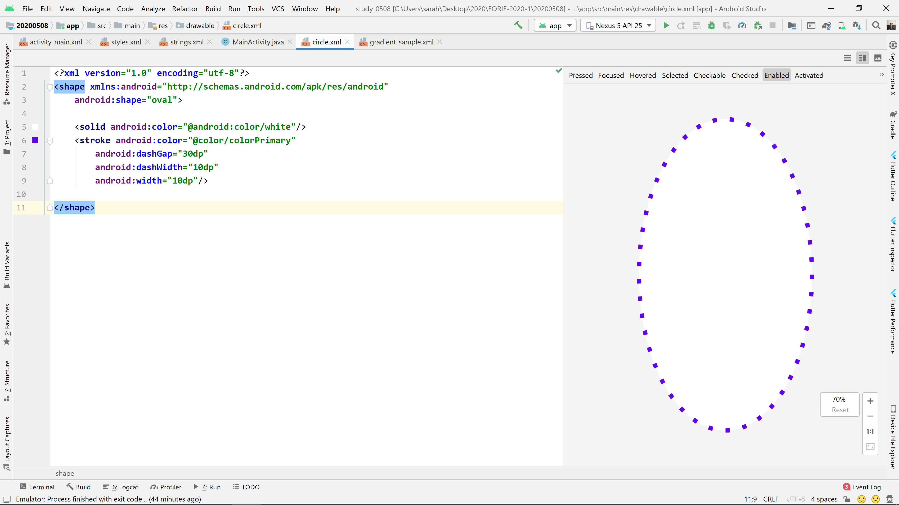
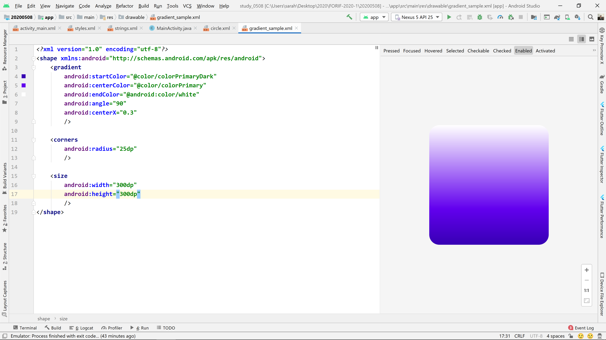

# Android Study 20200508

### 리스너 복습 

버튼 클릭과 같은 것을 Event 라고 한다. Event 에 대한 반응을 기다리고 그에 따라 적절한 코드를 실행해주도록 하는 것을 Listener 라고 한다. 

버튼을 누르면 화면이 바뀌는 경우 

1. 버튼 객체를 MainActivity 클래스의 인스턴스 변수로 선언한다. `Button button;`
2. `button = findViewById(R.id.button_id)` 와 같이 XML에 정의된 버튼을 Java 코드로 조작할 수 있도록 불러온다. 
3. `button.setOnClickListener()` 의 메소드의 매개변수로 리스너 객체를 넘겨준다. 

```java
button.setOnClickListener(new View.OnClickListener{
// new 키워드를 통해 View 클래스 안의 OnClickListener 
// 인터페이스를 익명 클래스로 구현해준 것.
	@Override
	public void onClick(View v){
	// 화면에서 버튼 클릭 이벤트가 발생하는 순간 실행되는 메서드
	}
});
```

4. `Toast.makeText(context, "띄울 문자열", Toast.LENGTH_SHORT).show()` 를 통해서 토스트 메시지를 띄울 수 있다. 

* 참고 : https://developer.android.com/reference/android/view/View.OnClickListener


### ImageView 의 visibility 속성

android:visibility = "visible" / "gone" / "invisible" 세 가지 중 하나로 설정해서 이미지를 보여주거나 숨기거나, 아예 없앨 수 있다. 

**Java 코드로 똑같은 효과를 낼 수 있다.** 

* imageViewObject.setVisibility(View.VISIBLE)
* imageViewObject.setVisibility(View.INVISIBLE) //눈에 보이지만 않는것
* imageViewObject.setVisibility(View.GONE) //아예 사라져버린 것

📌 **주의 : xml 파일의 이름을 정할때는 `lowercase_underscore` 과 같이 영어 소문자와 언더스코어만 섞은 문자열을 사용할 수 있다.** 

> 여기까지 복습이었습니다. 

---


### 퀴즈1 : XML 파일에 버튼만들기

```xml
<?xml version="1.0" encoding="utf-8"?>
<androidx.constraintlayout.widget.ConstraintLayout xmlns:android="http://schemas.android.com/apk/res/android"
    xmlns:app="http://schemas.android.com/apk/res-auto"
    xmlns:tools="http://schemas.android.com/tools"
    android:layout_width="match_parent"
    android:layout_height="match_parent"
    tools:context=".MainActivity">

    <Button
        android:layout_width="wrap_content"
        android:layout_height="wrap_content"
        android:text="^^\n버튼입니다"
        android:textColor="@android:color/white"
        android:textStyle="italic"
        android:backgroundTint="@android:color/black"
        app:layout_constraintBottom_toBottomOf="parent"
        app:layout_constraintLeft_toLeftOf="parent"
        app:layout_constraintRight_toRightOf="parent"
        app:layout_constraintTop_toTopOf="parent" />

</androidx.constraintlayout.widget.ConstraintLayout>
```



> 버튼을 만들어 보았습니다 ! 

💡 **팁 : 윈도우에서 화면 캡처하기 `window키 + shift + s`**

* Button 필수 속성 : layout_height, layout_width 
* 유저에게 보여지는 모든 문자열들은 (User facing String) 반드시 res > values > strings.xml 파일에 정의해야 한다. 이렇게 해야 나중에 여러 언어로 앱을 번역할 수 있음. 
* string resource 쉽게 추출하는 방법 : 

1. 추출할 문자열을 선택한다. 



2. alt + enter 를 누른다 -> extract string resource 선택 



3. resource name 지정하고 OK 클릭 



4. res > values > strings.xml 파일을 보면 아래와 같이 정의되어 있다. 




### 퀴즈 2 : 버튼에 클릭 리스너를 설정하고 클릭시 Toast 메시지가 뜨도록 해보자 


> Toast 메시지를 만들어 보았습니다!

```java
import androidx.appcompat.app.AppCompatActivity;

import android.os.Bundle;
import android.view.View;
import android.widget.Button;
import android.widget.Toast;

public class MainActivity extends AppCompatActivity {

    @Override
    protected void onCreate(Bundle savedInstanceState) {
        super.onCreate(savedInstanceState);
        setContentView(R.layout.activity_main);

        Button button = findViewById(R.id.btn_main);
        button.setOnClickListener(new View.OnClickListener() {
            @Override
            public void onClick(View v) {
                Toast.makeText(MainActivity.this,
                        "Sample Toast Message",
                        Toast.LENGTH_SHORT)
                        .show();
            }
        });
    }
}

```

💡 **팁 : Toast 메시지의 위치를 옮기고 싶다면?** 

토스트 객체에 setGravity 메서드를 호출하여 Gravity 상수와 x 좌표 오프셋, y좌표 오프셋을 차례대로 지정해준다. 아래의 샘플을 사용하면 토스트 메시지가 좌측 상단에 뜬다. 

```java
toast.setGravity(Gravity.TOP|Gravity.LEFT, 0, 0);
```

* 참고 : https://developer.android.com/guide/topics/ui/notifiers/toasts#Positioning

> 이 외에 다큐먼트를 보면 커스텀 토스트 메시지 레이아웃을 만드는 방법까지 나와있으니 디자인 욕심이 있는 분들은 도전해 보시면 좋을 듯 합니다. 다음 시간에 배울 Inflation ⭐ 에 대한 개념을 맛볼 수 있습니다.


### onCreate() 함수는 언제 호출되는가? 

앱을 실행할 때의 진입점. 비유하자면 C언어의 `main()` 함수, Java 의 `public static void main()` 함수 정도. 

* 참고 : https://hyeonstorage.tistory.com/149
* 다큐먼트 : https://developer.android.com/guide/components/activities/activity-lifecycle

운영체제에서는 프로그램 파일이 메모리에 로드되어 실행되면 이를 "프로세스"라고 부른다. 프로세스 실행의 처음부터 프로세스가 종료될때 까지의 과정을 프로세스 생명주기라 한다. 

안드로이드 어플리케이션 또한 일종의 프로그램으로, 앱이 메모리에 로드된 후 부터 실행 - 종료의 과정을 거친다. 이 때 개발자가 프로세스 실행에 필요한 자원을 적절히 요청하고 해제할 수 있도록 (resource allocation, aquisition / deallocation, release) 생명 주기에 따른 여러 callback 메소드를 제공해준다. 

lifecycle callback 메소드들로 onCreate, onStart, onDestroy ... 등이 있고 이는 프로세스의 생명 주기가 변함에 따라 자동으로 호출되는 메소드들이다. 앱 프로세스가 실행되기 시작할때는 onCreate 가 호출되고, 종료되는 시점에는 onDestroy 가 호출된다. 실행과 종료의 사이에 걸쳐져 있는 콜백 메소드들로는 onStart, onStop 등이 있다. 


### Drawable

> 연락처 앱을 만들 수 있어요 ! 

res > drawable 폴더 밑에 Drawable XML 파일을 만들어 줍니다. 

* **Shape Drawable** : 어떠한 모양을 나타내는 드로어블 ex. 사각형, 모서리가 둥근 사각형, 원형 등등 ...

* **State List Drawable** : 어떤 이벤트의 상태에 따라 변화하는 드로어블 

수업 예제에서 버튼에 테두리가 있는 것은 shape drawable 을 사용, 눌렀을때 색상이 변하는 것은 state list drawable 을 사용했다. 

`<shape>` 태그 안에 `<solid>` `<stroke` 같은 속성들을 지정해주면 원하는 도형 모양을 만들 수 있다. 

* 참고1 : https://developer.android.com/guide/topics/resources/drawable-resource#Shape 를 보시면 shape 태그 안에 사용할 수 있는 다양한 속성들을 확인할 수 있습니다. 
* 참고2 : https://developer.android.com/guide/topics/resources/drawable-resource#StateList 에서 State List Drawable 에 대한 다양한 속성들을 확인할 수 있습니다. 


### Oval 만들기 

```xml
<?xml version="1.0" encoding="utf-8"?>
<shape xmlns:android="http://schemas.android.com/apk/res/android"
    android:shape="oval">

    <solid android:color="@android:color/white"/>
    <stroke android:color="@color/colorPrimary"
        android:dashGap="30dp"
        android:dashWidth="10dp"
        android:width="10dp"/>

</shape>
```




### Gradient 만들기 

```xml
<?xml version="1.0" encoding="utf-8"?>
<shape xmlns:android="http://schemas.android.com/apk/res/android">
    <gradient
        android:startColor="@color/colorPrimaryDark"
        android:centerColor="@color/colorPrimary"
        android:endColor="@android:color/white"
        android:angle="90"
        android:centerX="0.3"
        />

    <corners
        android:radius="25dp"
        />

    <size
        android:width="300dp"
        android:height="300dp"
        />
</shape>
```




### Layer List 

* 다큐먼트 : https://developer.android.com/guide/topics/resources/drawable-resource#LayerList
* 예시 : https://www.dev2qa.com/android-layer-list-example/


### Selector 

* 예시 : https://blog.woniper.net/221

