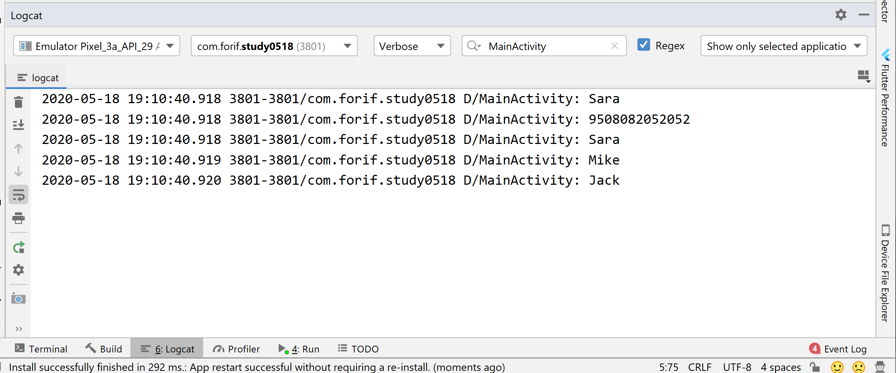
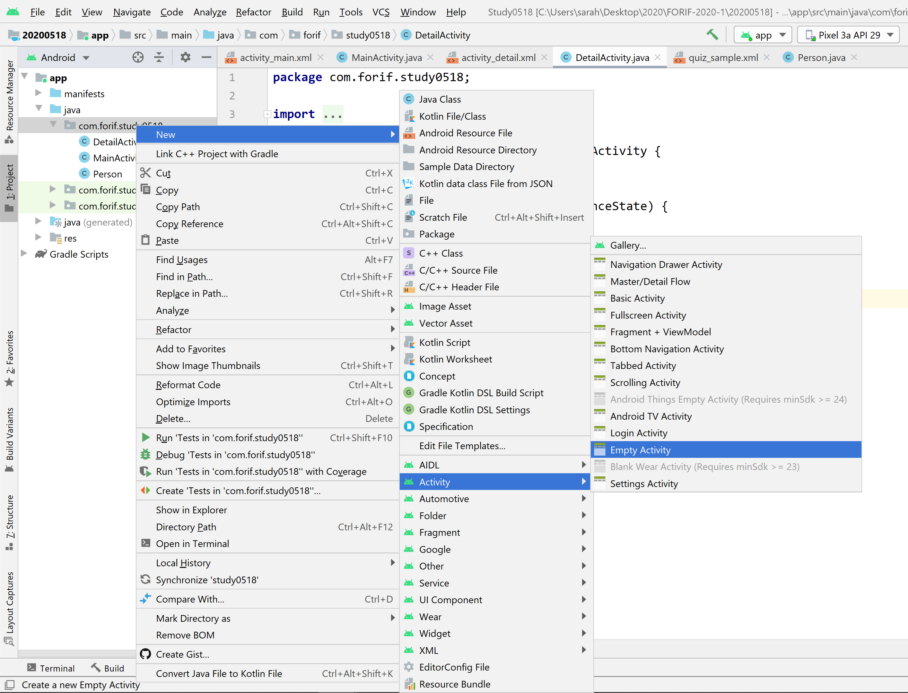
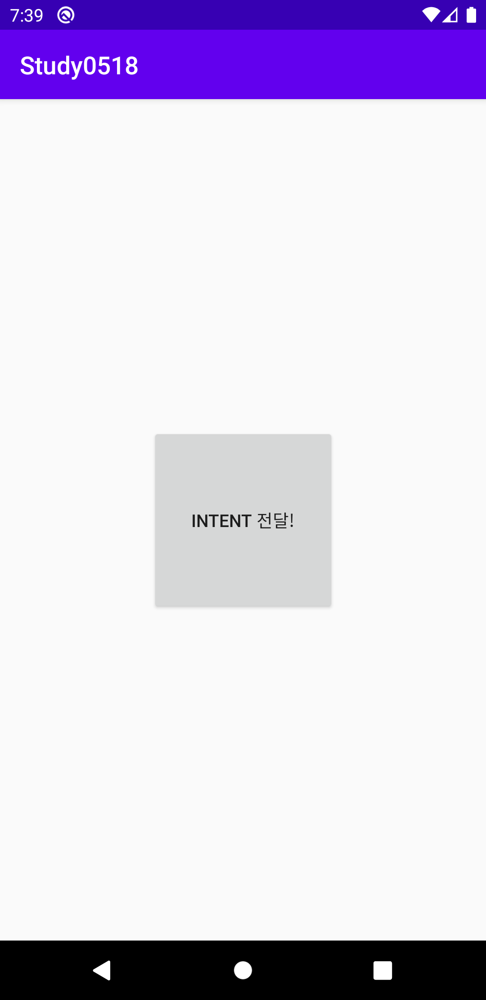
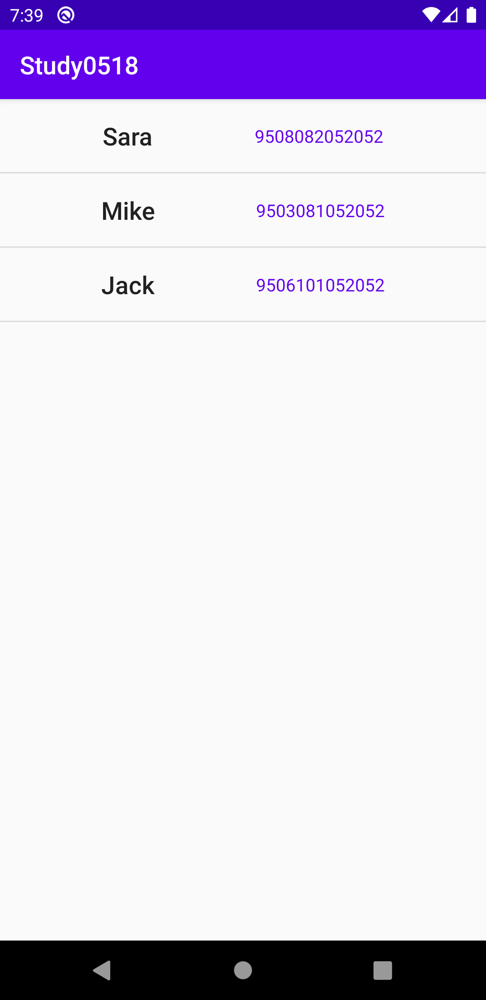

# Android Study 0518

> 이번 정리 자료는 ListView 와 Intent 를 응용해서 만들어 보았습니다. 

### ListView

* ListView 안에 들어가는 데이터는 Adpater 가 관리한다. 
* 데이터의 프레임은 별도의 레이아웃으로 만든다. 
* Adapter 클래스는 BaseAdpater 를 상속받는다. 
* 어댑터에 넣을 데이터를 위한 모델 클래스를 정의한다. 이와같은 Java 클래스를 POJO 라 부르기도 한다. 
  * POJO https://ko.wikipedia.org/wiki/Plain_Old_Java_Object
  * 모델 클래스는 그냥 현실의 개념을 Java 클래스로 나타낸 클래스이다. 예를들어 "사람"이란 개념을 코드로 나타내기 (모델링 하기) 위해서는 사람의 어떠한 속성을 필드로 지정할 것인지 생각해봐야 한다. 만약 사람의 이름, 사람의 주민번호를 필드로 정해서 모델 클래스를 만들면 아래와 같을 것이다.


### 모델 클래스 예시 

```java
package com.forif.study0518;

public class Person {

    private String name;
    private String idNumber;

    public Person(String name, String idNumber) {
        this.name = name;
        this.idNumber = idNumber;
    }

    public String getName() {
        return name;
    }

    public String getIdNumber() {
        return idNumber;
    }

}

```

위의 클래스에서 name 과 idNumber 를 private 으로 지정해 다른 클래스에서 접근할 수 없도록 하고, 오직 getter 를 통해서만 접근하도록 했다. 이는 객체지향 언어의 encapsulation (캡슐화) 라는 개념이다. 

위의 모델 클래스를 통해서 여러개의 다양한 Person 객체들을 찍어낼 수 있다. 

```java
package com.forif.study0518;

import androidx.appcompat.app.AppCompatActivity;

import android.os.Bundle;
import android.util.Log;

public class MainActivity extends AppCompatActivity {

    private static final String TAG = "MainActivity";
    
    @Override
    protected void onCreate(Bundle savedInstanceState) {
        super.onCreate(savedInstanceState);
        setContentView(R.layout.activity_main);
        
        
        // Person 이라는 모델 클래스를 통해서 객체들을 만들어 냅니다. 
        Person sara = new Person("Sara", "9508082052052");
        Person mike = new Person("Mike", "9503081052052");
        Person jack = new Person("Jack", "9506101052052");
        
        // 위의 객체들에 대한 정보에 접근하려면 getter 를 사용해야 한다.
        // 안드로이드 스투디오에서 값을 출력해 볼 때는 Log.d 메소드를 사용한다. 
        Log.d(TAG, sara.getName()); 
        // sara.name 은 접근되지 않는다. 
        Log.d(TAG, sara.getIdNumber());
        
    }

}

```


위와같이 객체들을 줄줄이 나열하면 당연히 관리하기 어려워진다. 따라서 저런 객체들을 담을 박스가 필요하다. 박스로 사용하는 자료구조 중 대표적인 것이 ArrayList 이다. ArrayList<데이터타입> 와 같이 지정하면 해당 박스에는 정해진 데이터타입만 들어갈 수 있게 된다. 


```java
package com.forif.study0518;

import androidx.appcompat.app.AppCompatActivity;

import android.os.Bundle;
import android.util.Log;

import java.util.ArrayList;

public class MainActivity extends AppCompatActivity {

    private static final String TAG = "MainActivity";
    private ArrayList<Person> personArrayList = new ArrayList<>();

    @Override
    protected void onCreate(Bundle savedInstanceState) {
        super.onCreate(savedInstanceState);
        setContentView(R.layout.activity_main);


        // Person 이라는 모델 클래스를 통해서 객체들을 만들어 냅니다.
        Person sara = new Person("Sara", "9508082052052");
        Person mike = new Person("Mike", "9503081052052");
        Person jack = new Person("Jack", "9506101052052");

        personArrayList.add(sara);
        personArrayList.add(mike);
        personArrayList.add(jack);

        // 위의 객체들에 대한 정보에 접근하려면 getter 를 사용해야 한다.
        // 안드로이드 스투디오에서 값을 출력해 볼 때는 Log.d 메소드를 사용한다.
        Log.d(TAG, sara.getName());
        // sara.name 은 접근되지 않는다.
        Log.d(TAG, sara.getIdNumber());
        
        printAllPeople(personArrayList); 
    }
    
    
    private void printAllPeople(ArrayList<Person> personArrayList){
        for (int i = 0; i < personArrayList.size(); i++) {
            // i 번째 Person 객체의 이름을 출력하라
            Log.d(TAG, personArrayList.get(i).getName()); 
        }
    }
    

}

```


위 코드를 실행해보면 Logcat 에 아래와 같이 찍힌다. 검색 필터로 MainActivity 를 치면 TAG 가 MainActivity 인 것들만 필터링 된다. 




### Intent (매우 중요함)

화면 구성과 전환의 가장 기초이자 핵심이다. 


* 시스템 구성 요소 : 안드로이드 앱을 이루는 가장 핵심적인 네 가지 구성요소들. 
  * [안드로이드 4대 컴포넌트](https://ggodol.tistory.com/entry/안드로이드안드로이드-4대-컴포넌트)
  * 이 중에서 Activity 에 대해서 이야기 해 보겠다. 


Activity 는 화면을 구성하는 요소. Activity 객체들은 System 에서 관리한다. System 과 Activity 가 주고 받는 데이터의 기본 단위가 Intent 이다. 

MainActivity -> System 에게 화면을 이동해 달라는 메시지를 Intent 에 담아서 전달 -> System 은 지정된 화면으로 이동한다. 

화면을 이동하면서 데이터도 같이 전달하고 싶으면 Intent 에 데이터를 담아서 전달하면 된다. 

* 한 화면에서 startActivity(Intent 객체 ) 호출 -> 다른 화면으로 이동한다. 


### 실습 

새로운 Activity 를만듭시다. 기존의 MainActivity 에 더해서 DetailActivity 라는 액티비티를 새로 만들어 줍시다. 



패키지에 마우스 우클릭 -> New -> Activity -> Empty Activity 를 클릭하면 새로운 화면을 위한 클래스 파일과 xml layout 파일이 생성됩니다. 


### Intent 와 ListView 의 응용 

위에서 만든 Person ArrayList 를 DetailActivity 로 전달한 후, Detail 화면의 ListView 에 띄우도록 하겠습니다. MainActivity 의 버튼을 클릭하면 정보가 전달되도록 만들어 보겠습니다. 


### 레이아웃 만들어주기 


> activity_main.xml 에 버튼을 만들어 줍시다. 

```xml
<?xml version="1.0" encoding="utf-8"?>
<androidx.constraintlayout.widget.ConstraintLayout xmlns:android="http://schemas.android.com/apk/res/android"
    xmlns:app="http://schemas.android.com/apk/res-auto"
    xmlns:tools="http://schemas.android.com/tools"
    android:layout_width="match_parent"
    android:layout_height="match_parent"
    tools:context=".MainActivity">

    <Button
        android:id="@+id/main_button"
        android:layout_width="150dp"
        android:layout_height="150dp"
        android:text="@string/press_to_send_intent_msg"
        app:layout_constraintBottom_toBottomOf="parent"
        app:layout_constraintLeft_toLeftOf="parent"
        app:layout_constraintRight_toRightOf="parent"
        app:layout_constraintTop_toTopOf="parent" />

</androidx.constraintlayout.widget.ConstraintLayout>
```


> ListView 에 띄울 요소들을 위한 레이아웃 list_view_holder.xml 을 만들어 줍니다. 

```xml
<?xml version="1.0" encoding="utf-8"?>
<androidx.constraintlayout.widget.ConstraintLayout xmlns:android="http://schemas.android.com/apk/res/android"
    xmlns:app="http://schemas.android.com/apk/res-auto"
    xmlns:tools="http://schemas.android.com/tools"
    android:layout_width="match_parent"
    android:layout_height="wrap_content">

    <TextView
        android:id="@+id/detail_list_name"
        android:layout_width="wrap_content"
        android:layout_height="wrap_content"
        android:layout_marginTop="16dp"
        android:layout_marginBottom="16dp"
        tools:text="NAME"
        android:textAppearance="@style/TextAppearance.AppCompat.Title"
        app:layout_constraintBottom_toBottomOf="parent"
        app:layout_constraintEnd_toStartOf="@+id/detail_list_id_number"
        app:layout_constraintHorizontal_bias="0.5"
        app:layout_constraintStart_toStartOf="parent"
        app:layout_constraintTop_toTopOf="parent" />

    <TextView
        android:id="@+id/detail_list_id_number"
        android:layout_width="wrap_content"
        android:layout_height="wrap_content"
        android:layout_marginTop="16dp"
        android:layout_marginBottom="16dp"
        tools:text="ID NUMBER"
        android:textColor="@color/colorPrimary"
        app:layout_constraintBottom_toBottomOf="parent"
        app:layout_constraintEnd_toEndOf="parent"
        app:layout_constraintHorizontal_bias="0.5"
        app:layout_constraintStart_toEndOf="@+id/detail_list_name"
        app:layout_constraintTop_toTopOf="parent" />

</androidx.constraintlayout.widget.ConstraintLayout>
```


> activity_detail.xml 파일을 아래와 같이 구성해 줍니다. 

```xml
<?xml version="1.0" encoding="utf-8"?>
<androidx.constraintlayout.widget.ConstraintLayout xmlns:android="http://schemas.android.com/apk/res/android"
    xmlns:app="http://schemas.android.com/apk/res-auto"
    xmlns:tools="http://schemas.android.com/tools"
    android:layout_width="match_parent"
    android:layout_height="match_parent"
    tools:context=".DetailActivity">

    <ListView
        android:id="@+id/detail_list_view"
        android:layout_width="match_parent"
        android:layout_height="match_parent"
        tools:listitem="@layout/list_view_holder"
        />


</androidx.constraintlayout.widget.ConstraintLayout>
```


### DetailActivity 에 정보 넘겨주기 

레이아웃 파일 구성이 끝났으니, Java 코드를 조작해 봅시다. 

```java
package com.forif.study0518;

import androidx.appcompat.app.AppCompatActivity;

import android.content.Intent;
import android.os.Bundle;
import android.util.Log;
import android.view.View;
import android.widget.Button;


import java.util.ArrayList;

public class MainActivity extends AppCompatActivity {

    private static final String TAG = "MainActivity";
    private ArrayList<Person> personArrayList = new ArrayList<>();


    @Override
    protected void onCreate(Bundle savedInstanceState) {
        super.onCreate(savedInstanceState);
        setContentView(R.layout.activity_main);


        // Person 이라는 모델 클래스를 통해서 객체들을 만들어 냅니다.
        Person sara = new Person("Sara", "9508082052052");
        Person mike = new Person("Mike", "9503081052052");
        Person jack = new Person("Jack", "9506101052052");

        personArrayList.add(sara);
        personArrayList.add(mike);
        personArrayList.add(jack);


        // 위에서 만든 사람들에 대한 정보를 DetailActivity 로 넘겨줍시다.
        // 인텐트를 통해서 우리가 만든 Person 객체들을 넘겨주려면 이 객체들은 Parcelable 이어야 합니다.
        // 안드로이드는 우리가 만든 Person 클래스에 대한 정보를 모르므로 이를 우리가 Parcelable 이라는
        // 이름으로 넘겨주는 것입니다.
        Button button = findViewById(R.id.main_button);
        button.setOnClickListener(new View.OnClickListener() {
            @Override
            public void onClick(View v) {
                Intent intent = new Intent(MainActivity.this, DetailActivity.class);
                intent.putParcelableArrayListExtra("PERSON_INFO", personArrayList);
                startActivity(intent);
            }
        });
    }


}

```

버튼 객체를 참조해서 클릭 리스너를 달아줍니다. onClick 메소드 안에 Intent 객체를 만들고, 데이터를 넘겨주는 intent.put~Extra 코드를 넣어줍니다. 그리고 마지막으로 startActivity 를 호출하는데, 이 때 매개변수로 위에서 만든 Intent 객체를 넣어줍니다. 


주의해야 할 점은 넘기는 데이터가 Person 이라는 "우리가 만든 클래스"이기 때문에 **안드로이드는 이러한 custom data type에 대해 전혀 모른다는 점입니다.** 따라서 Person 이라는 모델 클래스의 객체를 Intent 로 전달하기 위해서는 **Person 클래스가 Parcelable 인터페이스를 구현해야** 합니다. Parcelable 은 아래와 같이 구현합니다. 

```java
package com.forif.study0518;

import android.os.Parcel;
import android.os.Parcelable;

// Person 클래스는 Parcelable 을 구현함으로써 인텐트로 전달할 수 있게 됩니다.
public class Person implements Parcelable {

    private String name;
    private String idNumber;

    public Person(String name, String idNumber) {
        this.name = name;
        this.idNumber = idNumber;
    }

    protected Person(Parcel in) {
        name = in.readString();
        idNumber = in.readString();
    }

    @Override
    public void writeToParcel(Parcel dest, int flags) {
        dest.writeString(name);
        dest.writeString(idNumber);
    }

    @Override
    public int describeContents() {
        return 0;
    }

    public static final Creator<Person> CREATOR = new Creator<Person>() {
        @Override
        public Person createFromParcel(Parcel in) {
            return new Person(in);
        }

        @Override
        public Person[] newArray(int size) {
            return new Person[size];
        }
    };

    public String getName() {
        return name;
    }

    public String getIdNumber() {
        return idNumber;
    }

}
```

`class Person implements Parcelable ` 까지만 치면 빨간줄이 뜹니다. 이때 마우스 커서를 Person 앞에 두시고 Alt + Enter 를 눌러주시면 implement Parcelable 버튼이 뜹니다. 


**DetailActivity 의 ListView 를 위한 MyViewHolder 클래스와 MyAdapter 클래스는 예시 코드를 확인해 주세요.** 


DetailActivity 에서 위의 정보를 회수하려면 아래와 같이 똑같은 "PERSON_INFO" 라는 키값으로 정보를 회수해 주어야 합니다. 

```java
package com.forif.study0518;

import androidx.appcompat.app.AppCompatActivity;

import android.os.Bundle;
import android.widget.ListView;

import java.util.ArrayList;

public class DetailActivity extends AppCompatActivity {

    private ListView listView;
    private MyAdapter myAdapter;

    @Override
    protected void onCreate(Bundle savedInstanceState) {
        super.onCreate(savedInstanceState);
        setContentView(R.layout.activity_detail);


        ArrayList<Person> personArrayList = getIntent().getParcelableArrayListExtra("PERSON_INFO");
        // 전달할때 넣은 Key 값과 동일한 키로 정보를 회수합니다.

        //listView 객체를 참조해줍니다.
        listView = findViewById(R.id.detail_list_view);
        //listView 의 어댑터에 회수한 Person 리스트를 넣어줍니다.
        myAdapter = new MyAdapter(this, personArrayList);
        //listView 에 우리의 어댑터를 알려줍니다.
        listView.setAdapter(myAdapter);

    }
}

```


### 결과 화면 







>  위와 같이 한 화면에서 다른 화면으로 Intent 를 전달하는 것은 explicit intent 라 합니다. 이와 반대되는 implicit intent 는 한 앱에서 데이터를 전달하는 것이 아니라, (공유하기 버튼처럼) 다른 앱으로 데이터를 전달해 주는 경우 사용됩니다. 