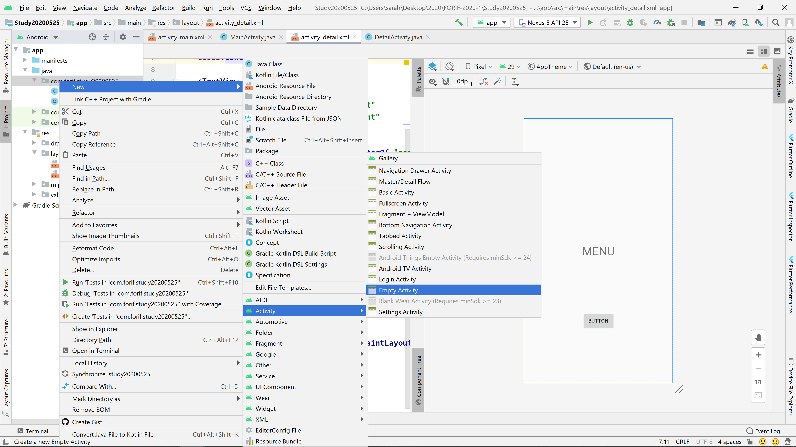
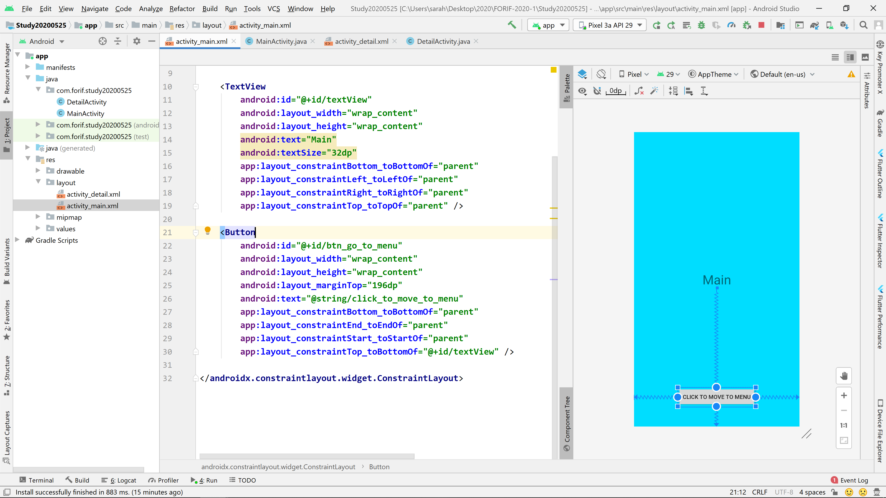
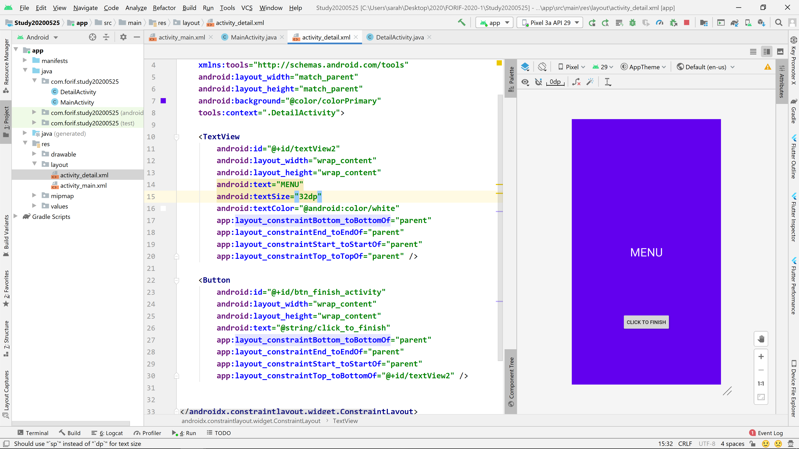
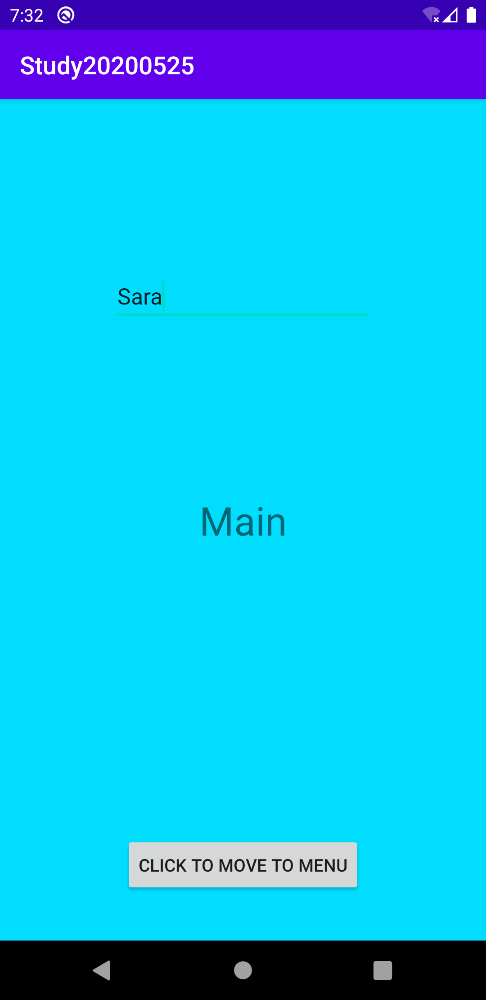
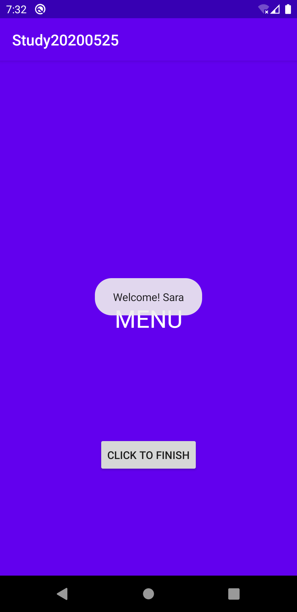
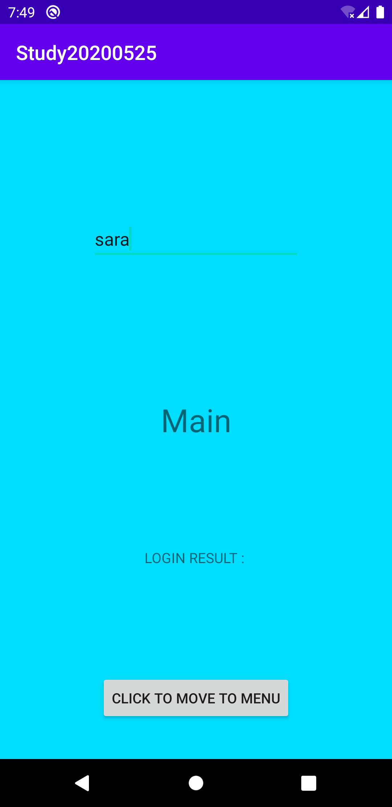
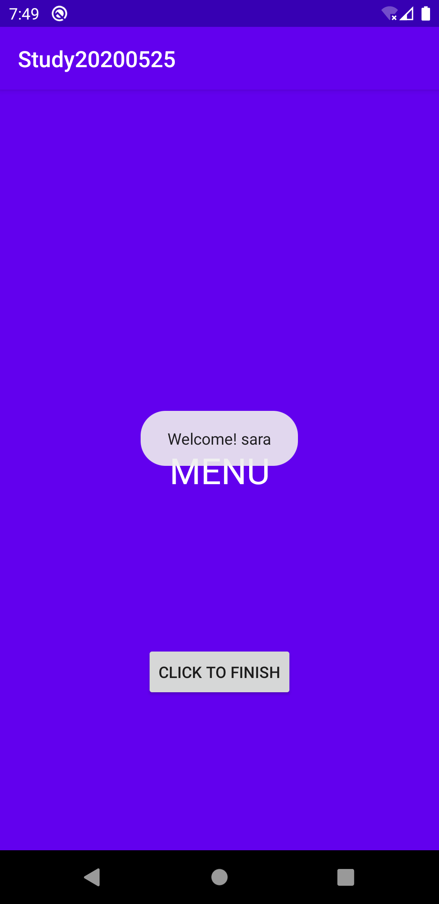
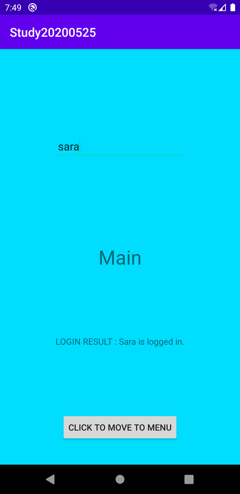

### Activity 에서 다른 Activity 로 이동하기 

```java
Intent intent = new Intent(this, DetailActivity.class); 
startActivity(intent); 
```

Intent 객체를 만들고, 생성자의 매개변수에 package context 와 이동할 Activity 클래스의 이름을 적어준다. 

startActivity 함수 안에 매개변수로 만든 intent 객체를 넘겨준다. 


#### AndroidManifest.xml 

`<activity>` 태그 안에 Activity 가 정의되어 있다. 




패키지 우클릭 - New - Activity - EmptyActivity 를 클릭하면 자동으로

1. 액티비티에 필요한 Java 파일과 
2. 그에 대응되는 레이아웃 xml 파일이 생성되고 
3. 해당 액티비티에 대한 정보를 담은  `<activity>` 태그가 manifest 파일 안에 생성된다. 

직접 세 개를 모두 손으로 써 넣어도 상관 없지만, 자동으로 만들어주는 기능을 활용하면 뭔가 빼먹거나 에러를 낼 염려가 없다. 


### 과제 해설 

1. MainActivity 를 만든다. (패키지 우클릭 - New - 하단의 Activity - Empty Activity 를 선택하고, 팝업창에서 액티비티의 이름을 MainActivity 로 설정해준다. )
2. activity_main.xml 을 아래와 같이 만들어준다. TextView 하나, Button 하나를 넣어주면 된다. 





3. DetailActivity 를 만든다. (패키지 우클릭 - New - 하단의 Activity - Empty Activity 를 선택하고, 팝업창에서 액티비티의 이름을 DetailActivity 로 설정해준다. )
4. detail_activity.xml 을 아래와 같이 만들어준다. 마찬가지로 TextView 하나와 Button 하나를 넣어주자. 





레이아웃을 만들었으니 클래스 파일에 들어가서 버튼 클릭 로직을 작성해준다. 


5. MainActivity.java 파일에 들어가서 버튼을 참조하고, 버튼에 클릭 리스너를 달아준다. 클릭시 DetailActivity 로 넘어가는 Intent 를 만들어준다. 


```java
package com.forif.study20200525;

import androidx.appcompat.app.AppCompatActivity;

import android.content.Intent;
import android.os.Bundle;
import android.view.View;
import android.widget.Button;

public class MainActivity extends AppCompatActivity {

    @Override
    protected void onCreate(Bundle savedInstanceState) {
        super.onCreate(savedInstanceState);
        setContentView(R.layout.activity_main);


        Button btnGoToMenu = findViewById(R.id.btn_go_to_menu);
        btnGoToMenu.setOnClickListener(new View.OnClickListener() {
            @Override
            public void onClick(View v) {
                Intent intent = 
                    new Intent(MainActivity.this, DetailActivity.class);
                startActivity(intent);
            }
        });

    }
}

```


6. DetailActivity.java 에 들어가서 해당 레이아웃의 버튼을 참조하고, 클릭 리스너를 달아준다. 클릭 시 해당 액티비티가 닫히는 것을 원하므로 onClick 메서드 안에 finish() 함수를 호출해준다. 


```java
package com.forif.study20200525;

import androidx.appcompat.app.AppCompatActivity;

import android.os.Bundle;
import android.view.View;
import android.widget.Button;

public class DetailActivity extends AppCompatActivity {

    @Override
    protected void onCreate(Bundle savedInstanceState) {
        super.onCreate(savedInstanceState);
        setContentView(R.layout.activity_detail);

        Button btnFinish = findViewById(R.id.btn_finish_activity);
        btnFinish.setOnClickListener(new View.OnClickListener() {
            @Override
            public void onClick(View v) {
                finish();
            }
        });
    }
}

```

* finish() 함수는 상위 클래스에서 이미 정의된 함수로, 클릭시 해당 액티비티 객체가 메모리 상에서 제거되면서 화면에서 사라진다. 


---


### Main 에서 Detail 로 String 값 넘겨주기 


1. activity_main.xml 에다가 EditText 를 추가해 줍니다. 
2. MainActivity.java 파일에서 Intent.putExtra() 메서드를 통해 정보를 넘겨줍니다. 
3. DetailActivity.java 파일에서 String userId = getIntent().getExtras().getString(KEY) 를 통해 넘어온 정보를 회수합니다. 
4. 받은 정보를 Toast 로 띄워줍니다. 


#### `activity_main.xml` 파일에 EditText 추가하기 

```xml
<?xml version="1.0" encoding="utf-8"?>
<androidx.constraintlayout.widget.ConstraintLayout xmlns:android="http://schemas.android.com/apk/res/android"
    xmlns:app="http://schemas.android.com/apk/res-auto"
    xmlns:tools="http://schemas.android.com/tools"
    android:layout_width="match_parent"
    android:layout_height="match_parent"
    android:background="@android:color/holo_blue_bright"
    tools:context=".MainActivity">

    <TextView
        android:id="@+id/textView"
        android:layout_width="wrap_content"
        android:layout_height="wrap_content"
        android:text="Main"
        android:textSize="32dp"
        app:layout_constraintBottom_toBottomOf="parent"
        app:layout_constraintLeft_toLeftOf="parent"
        app:layout_constraintRight_toRightOf="parent"
        app:layout_constraintTop_toTopOf="parent" />

    <Button
        android:id="@+id/btn_go_to_menu"
        android:layout_width="wrap_content"
        android:layout_height="wrap_content"
        android:layout_marginTop="196dp"
        android:text="@string/click_to_move_to_menu"
        app:layout_constraintBottom_toBottomOf="parent"
        app:layout_constraintEnd_toEndOf="parent"
        app:layout_constraintStart_toStartOf="parent"
        app:layout_constraintTop_toBottomOf="@+id/textView" />

    <EditText
        android:id="@+id/et_main_id"
        android:layout_width="wrap_content"
        android:layout_height="wrap_content"
        android:ems="10"
        android:hint="ID"
        app:layout_constraintBottom_toTopOf="@+id/textView"
        app:layout_constraintEnd_toEndOf="parent"
        app:layout_constraintStart_toStartOf="parent"
        app:layout_constraintTop_toTopOf="parent" />

</androidx.constraintlayout.widget.ConstraintLayout>
```


#### MainActivity 에서 정보 넘겨주기

```java
package com.forif.study20200525;

import androidx.appcompat.app.AppCompatActivity;

import android.content.Intent;
import android.os.Bundle;
import android.view.View;
import android.widget.Button;
import android.widget.EditText;

public class MainActivity extends AppCompatActivity {

    public static final String USER_ID_KEY = "user_id_key";

    @Override
    protected void onCreate(Bundle savedInstanceState) {
        super.onCreate(savedInstanceState);
        setContentView(R.layout.activity_main);


        //Edit text 객체를 참조해줍니다.
        final EditText editText = findViewById(R.id.et_main_id);

        Button btnGoToMenu = findViewById(R.id.btn_go_to_menu);
        btnGoToMenu.setOnClickListener(new View.OnClickListener() {
            @Override
            public void onClick(View v) {
                String userId = "";
                // 반드시 null 혹은 empty string 이 아닌지 확인해주어야 합니다.
                if(editText.getText() != null && !editText.getText().toString().equals("")){
                    userId = editText.getText().toString();
                }else{
                    userId = "anonymous";
                }

                Intent intent = new Intent(MainActivity.this, DetailActivity.class);
                // intent 객체에 데이터를 붙여서 다음 화면으로 넘겨줍니다.
                intent.putExtra(USER_ID_KEY, userId);
                startActivity(intent);
            }
        });


    }
}

```


#### DetailActivity 에서 정보 받아서 Toast 띄워주기 

```java
package com.forif.study20200525;

import androidx.appcompat.app.AppCompatActivity;

import android.os.Bundle;
import android.view.Gravity;
import android.view.View;
import android.widget.Button;
import android.widget.Toast;

// Main 에서 import 한 KEY 값을 사용합니다.
import static com.forif.study20200525.MainActivity.USER_ID_KEY;

public class DetailActivity extends AppCompatActivity {

    @Override
    protected void onCreate(Bundle savedInstanceState) {
        super.onCreate(savedInstanceState);
        setContentView(R.layout.activity_detail);

        String userId = getIntent().getExtras().getString(USER_ID_KEY);
        Toast welcomeToast = Toast.makeText(this, "Welcome! " + userId, Toast.LENGTH_LONG);
        welcomeToast.setGravity(Gravity.CENTER, 0, 0);
        welcomeToast.show();

        Button btnFinish = findViewById(R.id.btn_finish_activity);
        btnFinish.setOnClickListener(new View.OnClickListener() {
            @Override
            public void onClick(View v) {
                finish();
            }
        });
    }
}
```


#### 결과 화면 







---


### startActivityForResult 이용해보기 


DetailActivity 에서 MainActivity 에서 넘어갈 때 결과 코드를 반환해줍니다. 이 때 결과가 OK이면 Main 에서 특정 코드를 실행하고, 결과가 OK가 아니면 다른 코드를 실행하는 식으로 로직을 작성하게 됩니다. 


MainActivity.java 에 startActivity 대신 startActivityForResult 로 바꿔줍니다. 

```java
       btnGoToMenu.setOnClickListener(new View.OnClickListener() {
            @Override
            public void onClick(View v) {
                String userId = "";
                // 반드시 null 혹은 empty string 이 아닌지 확인해주어야 합니다.
                if(editText.getText() != null && !editText.getText().toString().equals("")){
                    userId = editText.getText().toString();
                }else{
                    userId = "anonymous";
                }

                Intent intent = new Intent(MainActivity.this, DetailActivity.class);
                // intent 객체에 데이터를 붙여서 다음 화면으로 넘겨줍니다.
                intent.putExtra(USER_ID_KEY, userId);
                startActivityForResult(intent, 1010);
                //startActivity(intent);
            }
        });

```


DetailActivity 의 버튼 클릭 리스너 안에 setResult 를 해줍니다. 

```java
package com.forif.study20200525;

import androidx.annotation.Nullable;
import androidx.appcompat.app.AppCompatActivity;

import android.content.Intent;
import android.os.Bundle;
import android.util.Log;
import android.view.Gravity;
import android.view.View;
import android.widget.Button;
import android.widget.Toast;

// Main 에서 import 한 KEY 값을 사용합니다.
import static com.forif.study20200525.MainActivity.USER_ID_KEY;

public class DetailActivity extends AppCompatActivity {

    public static final String RESULT_DATA_KEY = "result_data";

    @Override
    protected void onCreate(Bundle savedInstanceState) {
        super.onCreate(savedInstanceState);
        setContentView(R.layout.activity_detail);

        String userId = getIntent().getExtras().getString(USER_ID_KEY);
        Toast welcomeToast = Toast.makeText(this, "Welcome! " + userId, Toast.LENGTH_LONG);
        welcomeToast.setGravity(Gravity.CENTER, 0, 0);
        welcomeToast.show();

        Button btnFinish = findViewById(R.id.btn_finish_activity);
        btnFinish.setOnClickListener(new View.OnClickListener() {
            @Override
            public void onClick(View v) {
                Intent intent = new Intent();
                intent.putExtra(RESULT_DATA_KEY, "Sara is logged in.");
                setResult(RESULT_OK, intent);
                finish();
            }
        });
    }

}

```


Main 화면에서 결과값을 TextView 로 띄워줍니다. 

우선은 activity_main.xml 을 아래와 같이 수정해 줍시다. 

```xml
<?xml version="1.0" encoding="utf-8"?>
<androidx.constraintlayout.widget.ConstraintLayout xmlns:android="http://schemas.android.com/apk/res/android"
    xmlns:app="http://schemas.android.com/apk/res-auto"
    xmlns:tools="http://schemas.android.com/tools"
    android:layout_width="match_parent"
    android:layout_height="match_parent"
    android:background="@android:color/holo_blue_bright"
    tools:context=".MainActivity">

    <TextView
        android:id="@+id/textView"
        android:layout_width="wrap_content"
        android:layout_height="wrap_content"
        android:text="Main"
        android:textSize="32dp"
        app:layout_constraintBottom_toBottomOf="parent"
        app:layout_constraintLeft_toLeftOf="parent"
        app:layout_constraintRight_toRightOf="parent"
        app:layout_constraintTop_toTopOf="parent" />

    <Button
        android:id="@+id/btn_go_to_menu"
        android:layout_width="wrap_content"
        android:layout_height="wrap_content"
        android:layout_marginTop="196dp"
        android:text="@string/click_to_move_to_menu"
        app:layout_constraintBottom_toBottomOf="parent"
        app:layout_constraintEnd_toEndOf="parent"
        app:layout_constraintStart_toStartOf="parent"
        app:layout_constraintTop_toBottomOf="@+id/textView" />

    <EditText
        android:id="@+id/et_main_id"
        android:layout_width="wrap_content"
        android:layout_height="wrap_content"
        android:ems="10"
        android:hint="ID"
        app:layout_constraintBottom_toTopOf="@+id/textView"
        app:layout_constraintEnd_toEndOf="parent"
        app:layout_constraintStart_toStartOf="parent"
        app:layout_constraintTop_toTopOf="parent" />

    <TextView
        android:id="@+id/tv_main_login_result"
        android:layout_width="wrap_content"
        android:layout_height="wrap_content"
        android:text="LOGIN RESULT : "
        app:layout_constraintBottom_toTopOf="@+id/btn_go_to_menu"
        app:layout_constraintEnd_toEndOf="parent"
        app:layout_constraintStart_toStartOf="parent"
        app:layout_constraintTop_toBottomOf="@+id/textView" />

</androidx.constraintlayout.widget.ConstraintLayout>
```

맨 하단에 TextView 하나를 추가해 주었습니다. 


```java
package com.forif.study20200525;

import androidx.annotation.Nullable;
import androidx.appcompat.app.AppCompatActivity;

import android.content.Intent;
import android.os.Bundle;
import android.util.Log;
import android.view.View;
import android.widget.Button;
import android.widget.EditText;
import android.widget.TextView;

import static com.forif.study20200525.DetailActivity.RESULT_DATA_KEY;

public class MainActivity extends AppCompatActivity {

    public static final String USER_ID_KEY = "user_id_key";
    private TextView tvLoginResult;

    @Override
    protected void onCreate(Bundle savedInstanceState) {
        super.onCreate(savedInstanceState);
        setContentView(R.layout.activity_main);


        //Edit text 객체를 참조해줍니다.
        final EditText editText = findViewById(R.id.et_main_id);
        tvLoginResult = findViewById(R.id.tv_main_login_result);

        Button btnGoToMenu = findViewById(R.id.btn_go_to_menu);
        btnGoToMenu.setOnClickListener(new View.OnClickListener() {
            @Override
            public void onClick(View v) {
                String userId = "";
                // 반드시 null 혹은 empty string 이 아닌지 확인해주어야 합니다.
                if(editText.getText() != null && !editText.getText().toString().equals("")){
                    userId = editText.getText().toString();
                }else{
                    userId = "anonymous";
                }

                Intent intent = new Intent(MainActivity.this, DetailActivity.class);
                // intent 객체에 데이터를 붙여서 다음 화면으로 넘겨줍니다.
                intent.putExtra(USER_ID_KEY, userId);
                startActivityForResult(intent, 1010);
                //startActivity(intent);
            }
        });

    }


    @Override
    protected void onActivityResult(int requestCode, int resultCode, @Nullable Intent data) {
        super.onActivityResult(requestCode, resultCode, data);
        
        if(requestCode == 1010 && resultCode == RESULT_OK){
            tvLoginResult.append(data.getExtras().getString(RESULT_DATA_KEY));
        }else{
            tvLoginResult.append("No Data!");
        }
    }
}

```

* onActivityResult 를 override 해주어서 그 안에서 받아온 결과값과 데이터를 확인합니다. 


#### 결과 화면 



* EditText 안에 텍스트를 입력해 줍니다. 



* 토스트를 확인하고 finish 버튼을 클릭해서 이전 화면으로 되돌아 갑니다. 



* 받은 결과값을 Main 의 TextView 에 append 해서 결과를 확인합니다. 